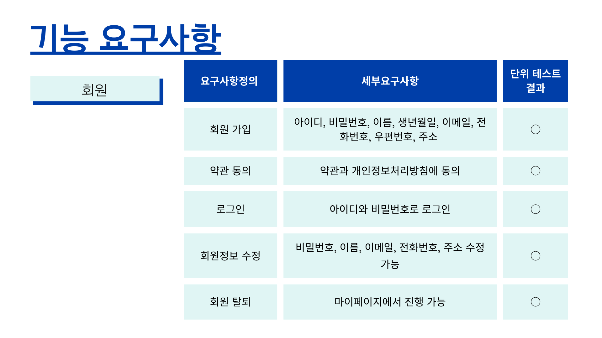
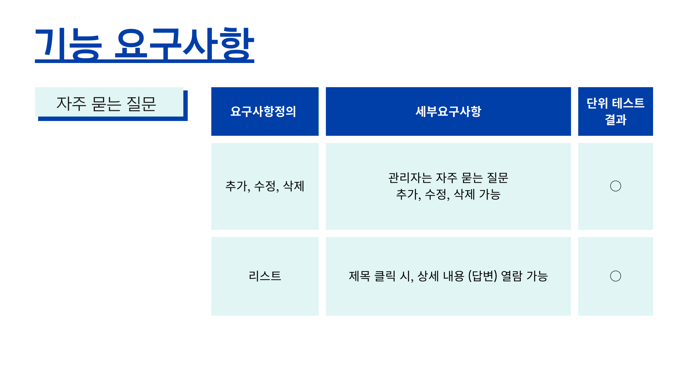
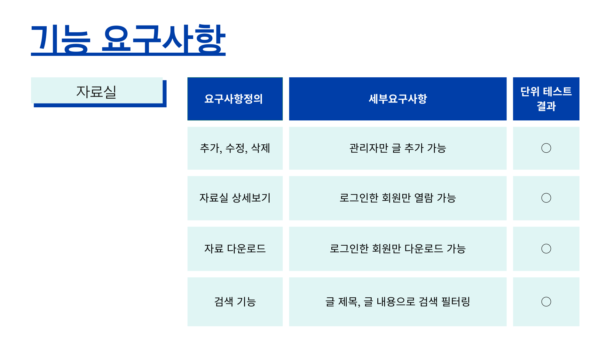
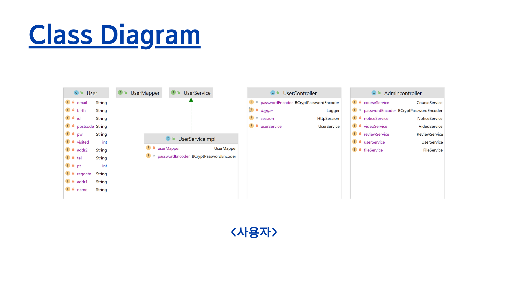
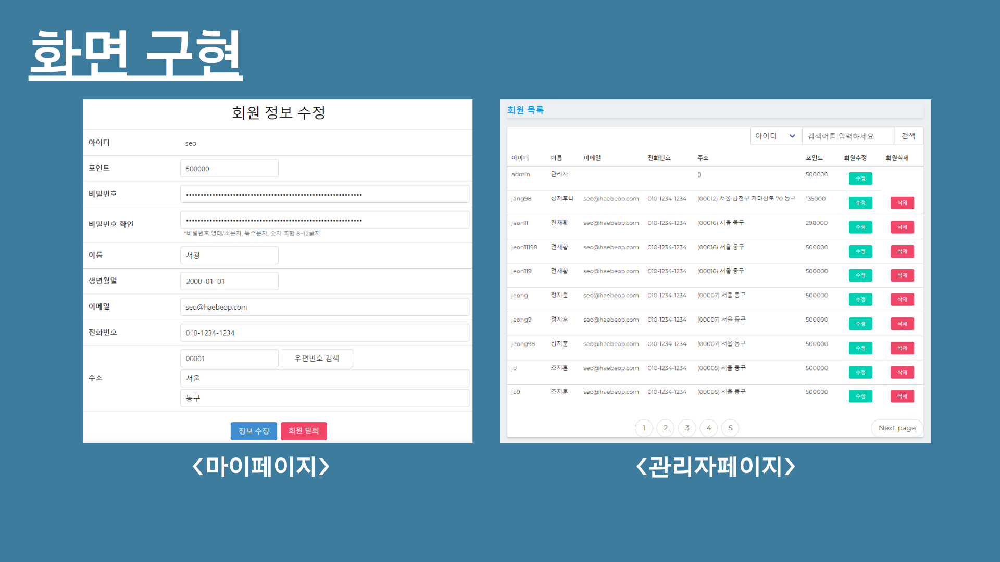

# SmartHaebeop_SoloProj04


## 기술 스택

### 📚 Tech Stack
#### 💻 Development


#### ⌛ Developed Period
##### 2023.12.31

## 진행 방식

**도커 파일 작성:**
```dockerfile
# 기본 이미지 선택
FROM some-base-image

# 작업 디렉토리 설정
WORKDIR /usr/src/app

# ARG 속성 추가 - 여러번 사용되는 문자열이나 숫자 등을 변수로 만들어주는 속성
ARG JAR_PATH=./build/libs

# 로컬 빌드 경로에서 JAR 파일을 이미지로 복사
COPY ./build/libs/smarthaebeop-0.0.1-SNAPSHOT.jar ./build/libs/app1-0.0.1-SNAPSHOT.jar

# 애플리케이션 실행 명령어 설정
CMD ["java","-jar","./build/libs/smarthaebeop-0.0.1-SNAPSHOT.jar"]
```

### 도커 이미지 빌드
```
docker build -t springbootapp .
```

### 도커 컨테이너 생성 및 실행
```
docker run -d --name my_app_container springbootapp
```


# 트러블 슈팅

<details>
 <summary><b>Log4j.xml 오류</b></summary>

>  Log4j가 설정 파일의 경로를 파싱하는 중에 URI에 유효하지 않은 문자
- Log4j.xml 생성 시 한글 ASCII 문자열로 인해 인식되는 현상으로 생긴 오류

## 원인이 뭘까? 🧐
> 에러 메시지에서 Path contains invalid character: 프 부분을 보면, 설정 파일의 경로에 "프"라는 한글 문자가 포함되어 있어서 발생한 것

## 어떻게 해결하나요? 🧐
> Log4j 설정 파일 경로 수정
- 설정 파일의 경로에서 한글 문자를 제거하거나, ASCII 문자로 대체해야 합니다. 위에서 제시된 경로에서 "프" 부분을 적절한 영문 문자로 변경
</details>

<br/>

<details>
 <summary><b>특정 Window11 탑재 노트북 HediSQL 사용 시 DB가 한글 인식이 안되는 현상</b></summary>

>  HediSQL 사용 시 DB가 한글 인식이 안되는 현상
- 문자열 컬럼에 유효하지 않은 문자열 데이터가 삽입되었을 때 발생한 오류

## 원인이 뭘까? 🧐
> UTF-8 문자 인코딩이 필요한데, 유효하지 않은 UTF-8 문자열이 삽입되어 오류가 발생 즉, '\xEA\xB4\x80\xEB\xA6\xAC...'와 같은 문자열은 UTF-8로 인코딩된 한글 문자열임. 그러나 테이블의 name 컬럼 또는 해당 쿼리에 대한 문자열 인코딩이 잘못되어 발생한 오류이며, MySQL에서는 이를 "Incorrect string value" 오류로 보고 

## 어떻게 해결하나요? 🧐
> DB 생성 시 DB 자체의 인코딩 변경

```sql
    ALTER DATABASE haebeop DEFAULT CHARACTER SET utf8 COLLATE utf8_general_ci;
```
</details>
<hr>

<details>
 <summary><b>상세 기능 구현</b></summary>

>  강의 등록 시 수강 신청 페이지 렌더링
> - MariaDB 파일 정보 추가
> > 
> - 수강신청 페이지에서 추가 내용 확인 가능
> > 
</details>

<hr>
<details>
  <summary><b>시범강의 웹사이트 "스마트 해법 발표자료"</b></summary>
<div>
















  </div>
</details>

## 💡 Commit Convention

|       Tags       |               Explanation               |
| :--------------: | :-------------------------------------: |
|       Feat       |            새로운 기능 추가             |
|       Fix        |                버그 수정                |
| !BREAKING CHANGE |         커다란 API 변경의 경우          |
|     !HOTFIX      |          급한 치명적 버그 수정          |
|      Build       |           빌드 관련 파일 수정           |
|      Design      |        CSS를 포함 UI 디자인 변경        |
|       Docs       |                문서 수정                |
|      Style       | 코드 포맷팅, 세미콜론 누락, 코드 변경 X |
|     Refactor     |              코드 리팩토링              |
|     Comment      |        필요한 주석 추가 및 변경         |
|       Test       |            테스트 코드 수정             |
|      Rename      |         파일, 폴더명 이름 수정          |
|      Remove      |             파일, 폴더 삭제             |
|      chore       |            빌드, 패키지 수정            |